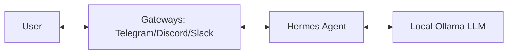

# Project Overview

This document provides a high-level overview of the Hermes Agent and Ollama setup, explaining the core concepts, architecture, and data flow.

## Terminology

- **Hermes Agent**: An open-source autonomous agent framework designed to handle complex tasks through various integrations.
- **Ollama**: A tool that allows you to run large language models (LLMs) like Llama 3, Mistral, and others locally on your machine.
- **Gateway**: A connector that bridges Hermes Agent with external communication platforms such as Telegram, Discord, Slack, or Email.
- **Provider**: The LLM backend configuration. In this setup, Ollama serves as the local provider.

## Architecture

The system consists of three main layers:

1.  **Interaction Layer (Gateways)**: Where the user interacts with the agent (e.g., Telegram chat).
2.  **Logic Layer (Hermes Agent)**: The core engine that processes requests, manages state, and decides which tools or models to use.
3.  **Intelligence Layer (Ollama)**: The local LLM engine that generates text based on the agent's prompts.

## Data Flow

1.  **Input**: A user sends a message through a configured Gateway (e.g., Telegram).
2.  **Reception**: The Gateway receives the message and forwards it to the Hermes Agent service.
3.  **Processing**: Hermes Agent analyzes the input and prepares a prompt for the LLM.
4.  **Inference**: Hermes Agent sends the prompt to the local Ollama API.
5.  **Generation**: Ollama generates a response and returns it to Hermes Agent.
6.  **Response**: Hermes Agent formats the response and sends it back to the user via the Gateway.

## Why This Setup?

- **Privacy**: By using Ollama, your data stays on your local machine and is not sent to third-party LLM providers.
- **Cost**: Running local models is free once you have the hardware.
- **Control**: You have full control over the agent's behavior and the models it uses.

## Advanced Operations (Phase 3)

For users who want to go beyond the basic setup, we provide advanced guides and tools:

- **[Task Management](../90-task-management.md)**: Strategies for decomposing complex tasks and optimizing context.
- **[Advanced Tooling](../100-advanced-tooling.md)**: Deep dive into tool integration and API usage.
- **[Metrics & ROI Tracking](../110-metrics-tracking.md)**: Framework for tracking AI usage and calculating ROI.
- **[Automation Scripts](../../scripts/automation/)**: Scripts for model management and updates.
- **[Skill Library](../../examples/skills/)**: A collection of reusable skills and templates.
- **[Project Retrospective](retrospective_template.md)**: Template for evaluating project iterations.
